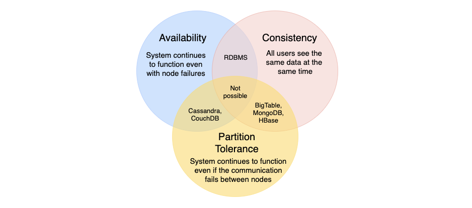

# CAP THEOREM 🎩

1. [Summary](#summary)
2. [Consistency](#consistency)
3. [Availability](#availability)
4. [Partition Tolerance](#partition-tolerance)

## SUMMARY

The **CAP Theorem** states that it is impossible for a distributed system to simultaneously provide more than two out of three of the following guarantees (CAP) - Consistency, Availability, and Partition Tolerance.

Trading off among CAP is almost the first thing we want to consider.

## CONSISTENCY

All nodes see the data at the same time. This is achieved by updating several nodes before allowing further reads.

## AVAILABILITY

Every request gets a response on success/failure. Availability is achieved by replicating the data across different servers.

## PARTITION TOLERANCE

The system continues to work despite message loss or partial failure. The system can sustain any amount of network failure and doesn't result in the entire system failing. Data is sufficiently replicated across nodes and networks to keep the system up through intermittent outages.
