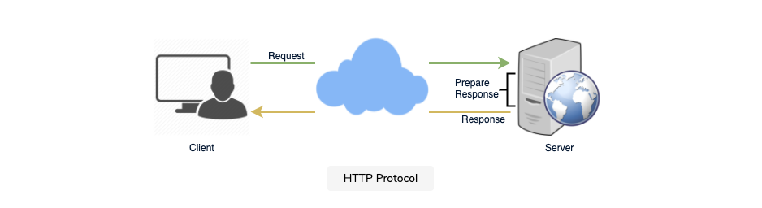
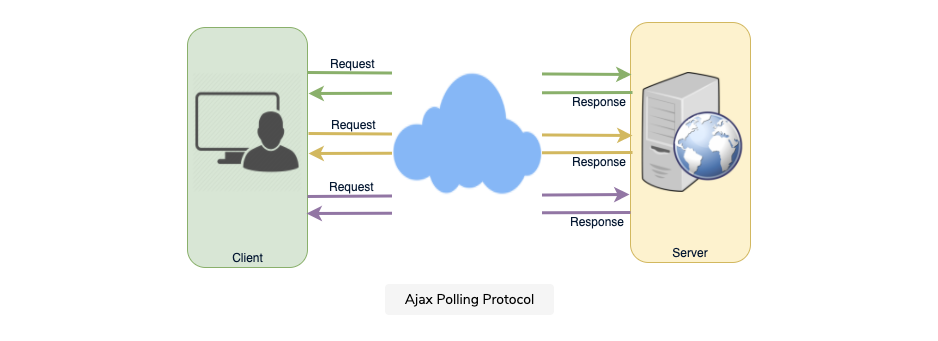
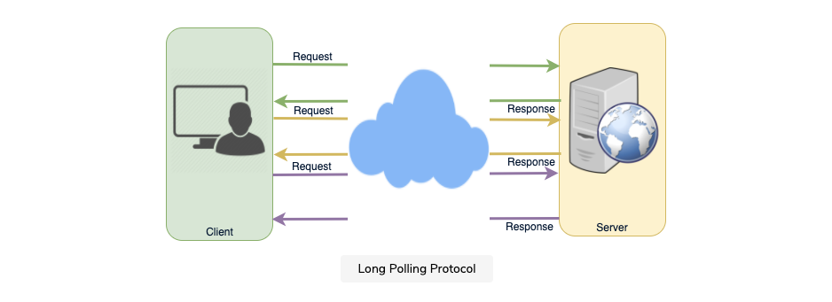
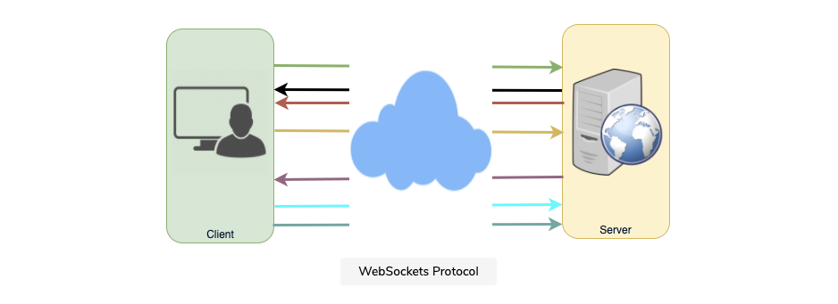
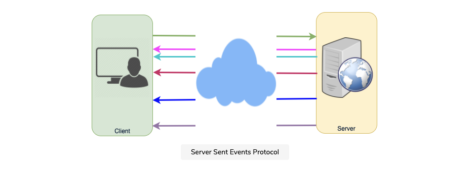

# COMMUNICATION PROTOCOLS

1. [Summary](#summary)
2. [AJAX Polling](#ajax-polling)
3. [HTTP Long-Polling](#http-long-polling)
4. [WebSockets](#websockets)
5. [Server-Sent Events (SSEs)](#server-sent-events-sses)

## SUMMARY

Long-Polling, WebSockets, and Server-Sent Events are popular communication protocols between a client like a web browser and a web server. First, let's start with understanding what a standard HTTP request is and what it looks like.

This is the sequence of events for a regular HTTP request:

1. The client opens a connection and requests data from the server
2. The server calculates the response
3. The server sends back the response to the client on the opened request

Example:

## AJAX POLLING

This is the technique used by most AJAX applications. The basic idea is that the client repeatedly polls (or requests) a server for data.

The problem with polling is that the client has to keep asking the server for any new data. As a result, a lot of responses are empty, creating HTTP overhead.

## HTTP LONG-POLLING

This variation of the traditional polling described just above allows the server to push information to a client whenever the data is available. With Long-Polling, the client requests information from the server exactly as before but knows that the server might not respond immediately. This technique is also referred to as a "Hanging GET."

When a client finally gets a response from the server, it immediately requests again and allows the server to hold onto that requests indefinitely.

Each Long-Poll request will typically have a timeout. The client has to reconnect periodically after the connection is closed due to the timeout.

## WEBSOCKETS

A WebSocket probides [full duplex](<https://en.wikipedia.org/wiki/Duplex_(telecommunications)#Full_duplex>) communication (communication in both directions) simultaneously over a single TCP (Transmission Control Protocol) connection. It provides a persistent connection between a client and a server that both parties can use to start sending data at any time.

The process of establishing a WebSocket connection is called "the WebSocket handshake." If the process succeeds, then the server and client can exchange data in both directions at any time.

This enables communication between a server and client with lower overheads, facilitating real-time data transfer from-and-to the server and bi-directional communication.

## SERVER-SENT EVENTS (SSEs)

Finally, an SSE connection allows the client to extablish a persistent and long-term connection with the server. The server then uses this connection to send data to a client. If the client wants to send data to the server, it would require another technology or protocol to do so.

In this way, you can think of this protocol as open-ended but one-way.

SSEs are best when we ned real-time traffic from the server to the client or if the server is generating data in a lop and will be sending multiple events to the client.

