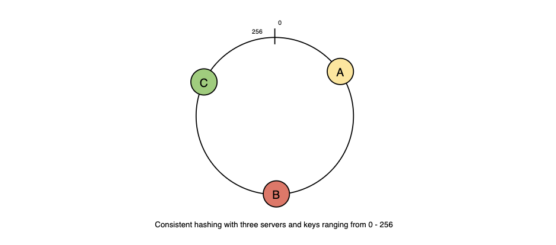
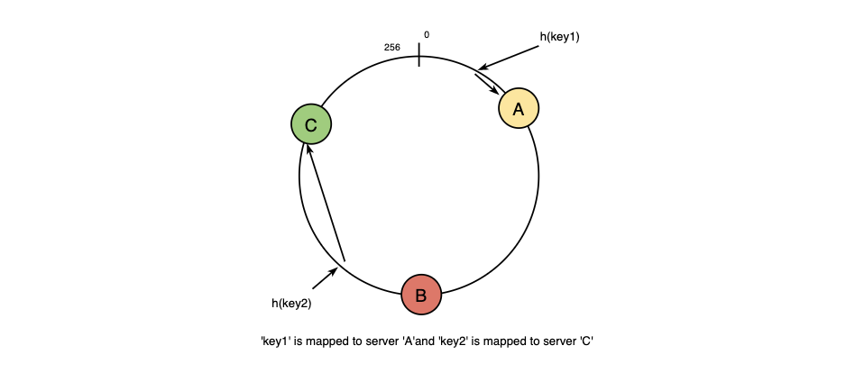
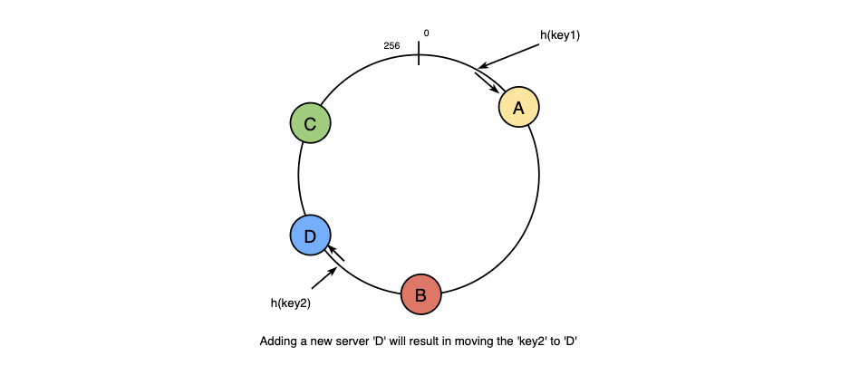
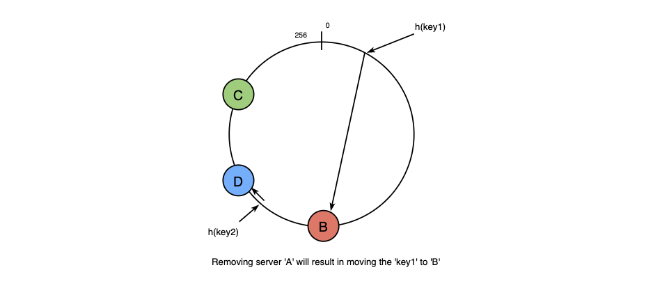
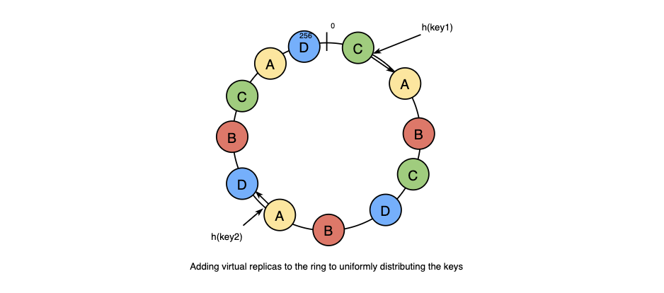

# CONSISTENT HASHING #️⃣

1. [Summary](#summary)
2. [What is Consistent Hashing?](#what-is-consistent-hashing)
3. [How does it work?](#how-does-it-work)

## SUMMARY

A **Distributed Hash Table (DHT)** is one of the fundamental components/ideas used in distributed scalable systems. Hash Tables need a key, a value, and a hash function where hash function maps the key to a location where the value is stored.

```bash
index = hash_function(key)
```

Suppose we are designing a distributed caching system. Given `n` cache servers, an intitutive hash function would be `key % n`. It is simple and commonly used. But there's two major drawbacks to it:

1. It's is NOT horizontally scalable. Whenever a new cache host is added to the sytem, all existing mappings are broken. It will be a pain point if the caching system contains a lot of data. It becomes difficult to schedule a downtime to update all caching mappings.
2. It may NOT be load balanced, expecially for non-uniformly distributed data. It can be assumed that the data will not be deistributed uniformly. For the caching system, this means that some caches become hot and saturated while the others idle and are almost empty.

Consistent Hashing can solve these problems.

## WHAT IS CONSISTENT HASHING?

Consistent hasing is a useful strategy for distributed caching systems and DHTs. It allows us to distribute data across a cluster in such a way that will minimize reorganization when nodes are added or removed. This means that the caching system will be easier to scale up or scale down.

When the hash table is resized with Consistent Hashing (like when a new cache host is added to the system), only `k/n` keys need to be remapped (where `k` is the total number of keys and `n` is the total number of servers). This is in contrast to a caching system using a `%` (mod) as the hash function, as all keys would need to be remapped.

In Consistent Hashing, objects are mapped to the same host if possible. When a host is removed from the system, the objects on that host are shared by the other shosts. When a new host is added, it takes its share from a few hosts without touching other's shares.

Magic ✨

## HOW DOES IT WORK?

Just like in a typical hash function, Consistent Hashing maps a key to an integer. If the output of the function is in the range of [0, 256] and the integers in the range are placee in a ring, here's an example of how that would play out:

1. Given a list of cach servers, has them to integers in the range
2. Map a key to a server
   - Hash it to a single integer
   - Move clockwise on the ring until finding the first cache it encounters
   - That cache is the one that contains the key. See animation below as an exmaple: `key1` maps to cache `A`; `key2` maps to cache `C`.

If we want to add a new server, keys that were originally at `C` will have to be split. Some of them will be shifted to `D` (the new server), while other keys won't be touched.

If we remove a cache (or if one fails, say `A`), all keys that were originally mapped to `A` will fall into `B`. Only those keys need to be moved to `B` - other keys will not be affected.

For load balancing, the real data is essentially randomly distributed and thus may not be uniform. It may make the keys on caches unbalanced.

To fix this issue, we need to add `virtual replicas` for caches. Instead of mapping each cache to a single point on the ring, we map it to multiple points on the ring (e.g. replicas). This way, each cache is associated with multiple portions of the ring but not a 1:1 relationship with a server.

If the has function "mixes well", the keys will be more balanced as the number of replicas increases.

Here's an example of a flow of adding/removing servers to a Consistently Hashed system:










