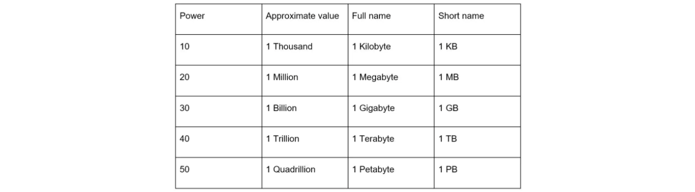
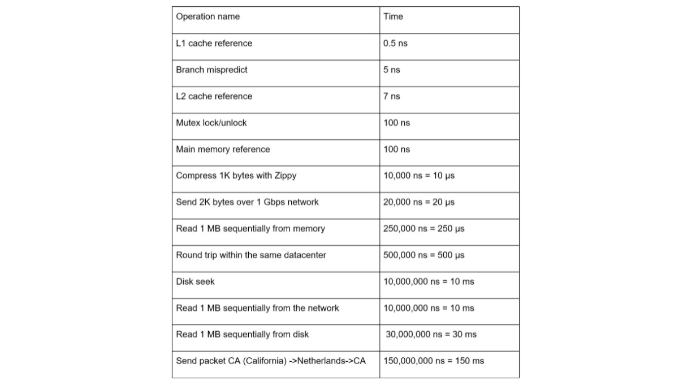

# ESTIMATING CAPACITY

Sometimes you'll be asked to estimate a system's capcity or performance requirements with back-of-the-envelope estimations.

You need to have a good grasp of scaling basics to effectively do these calculations. The following concepts should be well-understood:

- Power of two
- Latency numbers every programmer should know
- Availability numbers

## TABLE OF CONTENTS

1. [Power of Two](#power-of-two)
2. [Latency Numbers Every Programmer Should Know](#latency-numbers-every-programmer-should-know)
3. [Availability Numbers](#availability-numbers)
4. [Facebook Example](#facebook-example)

## POWER OF TWO

Although data volume can become enormous when dealing with distributed systems, calculation all boils down to the basics. It is critical to know the data volume unit using the power of 2. A byte is a sequence of 8 bits. An ASCII character uses one byte of memory (8 bits). Below is a table explaining the data volume table:

## LATENCY NUMBERS EVERY PROGRAMMER SHOULD KNOW

## AVAILABILITY NUMBERS

Highly available systems should be continuously operational for a long period of time. High availability is measured as a percentage, with 100% meaning that the service has 0 downtime. Most services fall between 99% and 100%.

An service level agreement (SLA) is a commonly used term for service providers. This is an agreement between you and your customer. It formally defines the level of uptime your service will deliver. Cloud providers like Amazon, Google, and Microsoft set their SLAs at 99.9% or above. Uptime is traditionally measured in "9"s. The more nines, the better.

Example:

## FACEBOOK EXAMPLE

(Note - not real numbers.... obviously)

Assumptions:

- 3000 million monthly active users
- 50% users use Facebook daily
- Users make 2 posts per day on average
- 10% of posts contain media
- Data is stored for 5 years

Estimations:

- Daily Active Users (DAU) = 300 million \* 50% = 150 million
- Posts queries per second (QPS) = 150 million \* 2 posts / 24 hours / 3600 seconds = ~3500 post QPS
- Peak QPS = 2 \* QPS = ~7000

Potential Storage:

- Average post size:
  a. post_id 64 bytes
  b. post 140 bytes
  c. media 1 MB

- Media storage = 150 million _ 2 _ 10% \* 1 MB = 30 TB per day
- 5 year media storage = 30 TB _ 365 _ 5 = ~55 PB

## TIPS

Making these calculations is all about the process. Solving the problem is more important than obtaining results. Interviewers may test your problem solving skills. Here's some tips:

- **Rounding and Approximation:** It's difficult to perform complicated math operations during the interview. Precision is not expected. Use round numbers and approximation to your advantage.
- **Write down your assumptions:** It is a good idea to write down your assumptions to be referenced later
- **Label your units:** When you write down "5", put down the unit for it. You could confuse yourself later on if you don't.
- **Commonly asked back-of-the-envelope estimations:** QPS, peak QPS, storage, cache, numbers of servers, etc. You can practice these calculations when prepping for an interview.
