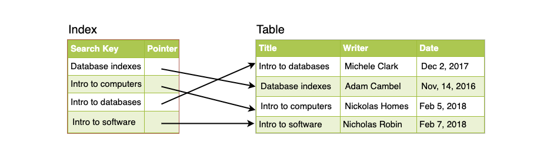

# INDEXES ☝🏻

1. [Introducion](#introduction)
2. [Example: Library Catalog](#example-library-catalog)
3. [What is an index?](#what-is-an-index)
4. [How do Indexes Decrease Write Performance?](#how-do-indexes-decrease-write-performance)

## INTRODUCTION

Indexes are well known when it comes to DBs. One of the first things you should turn to when a database is no longer performant is database indexing.

The goal of creating an index on a particular table in a database is to make it faster to search through the table and find the row or rows that we want. Indexes can be created using one or more columns of a database table, providing the basis for both rapid random lookups and efficient access of ordered records.

## EXAMPLE: LIBRARY CATALOG

A library catalog contains a list of books in a library. The catelog is organized like a database table with columns for various bits of information.

Often, there are usually two such catalogs - one by artist name and one by book title. These are like indexes for a database of books. They provide sorted data that you can easily search by relevant information.

## WHAT IS AN INDEX?

An index is a data structure that can be seen as a table of contents that points us to the location where actual data lives. When we create an index on a column of a table, we store that column and pointer to the whole row in the index.

Here's an example borrowing the previous example of books:

With indexes, we must consider how users will access the data. In the case of data sets that are many terabytes in size but have small payloads, indexes are a necessity for optimizing data access. Finding these small payloads in a large dataset is a big challenge since we can't iterate over all of the terabytes of data in a performant and timely manner.

The large dataset is also probably spread over many devices which means that we need to find some way of exploring the correct physical location of the desire data. Indexes are the way to do this.

## HOW DO INDEXES DECREASE WRITE PERFORMANCE?

The problem is that indexes can dramatically speed up data retrieval but may be a large cost due to the additional keys which slow down data insertion and updates in the database.

When adding rows or making updates to existing rows in a table with an active index, we have to write the data AND update the index. This obviously decreases the write performance. This degradation applies to ALL insert, update, and delete operations for the table.

Because of this, adding unnecessary indexes on tables should be avoided and indexes that are no longer used should be removed. Adding indexes on a table is about improving the performance of search queries. If the goal is to provide a data store that is often written to and updated/deleted but not read from as often, decreasing of the main operations through heavy indexing might not be worth the increase in performance we get from reading.
