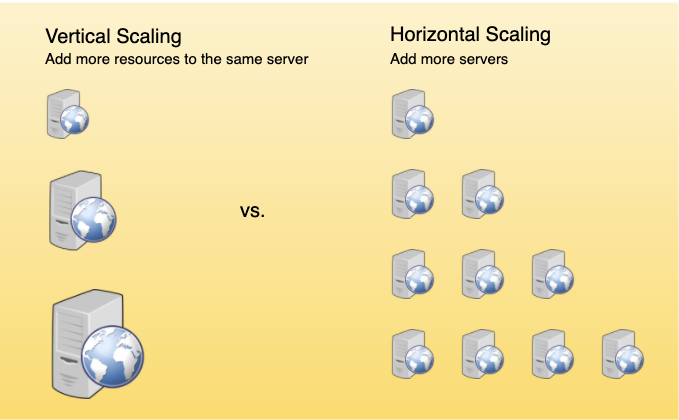

# KEY CHARACTERISTICS OF DISTRIBUTED SYSTEMS

1. [Scalability](#scalability)
   - [Horizontal Scaling](#horizontal-scaling)
   - [Vertical Scaling](#vertical-scaling)
2. [Reliability](#reliability)
3. [Availability](#availability)
4. [Efficiency](#efficiency)
5. [Serviceability or Manageability](#serviceability-or-manageability)

## SCALABILITY

This is the ability of the system, process, or a network to grow and manage increased demand. A distributed system that can continuously evolve in order to support the growing amount of work is considered scalable.

There should be no massive performance loss.

Generally, the performance iof a system declines with the system size because of management/environment cost. Network speeds are slower when machines are far apart from each toher. Additionally, some tasks may not be distrubted, either because of their inherent atomic nature or because of some flaw in the system design.

These tasks would limit the speed that can be obtained by the distributed system. Architecutre that can scale avoids this situation and attempts to balance the load on all participating nodes in the system evenly.

### HORIZONTAL SCALING

Horizontal scaling means that you can by adding more machines (servers) into your pool of resouces. You have more nodes in the system.

This is often easier to do dynamically (especially with the advent of cloud computing) since you can just spool up a new machine when demand spikes.

Examples of this include Cassandra or MongoDB as they scale horizontally by adding more machines to meet growing demand.

### VERTICAL SCALING

Vertical scaling means that you add more power (e.g. CPU, RAM, etc.) onto a server.

This is more difficult as you often have downtime and comes with an upper limit before more downtime.

A good example of vertical scaling is MySQL as it allows for switching from smaller to bigger machines that involves downtime.

## RELIABILITY

Reliability "is the probability a system will fail in a given period." This means that a distributed system is considered reliable if it keeps delivering its services even when onre or several of its software or hardware components fail.

This is one of the main characterstics of anhy distributed system, since a failing machine can always be replaced by another healthy one, ensuring the completion of the requested task.

Amazon has a requirement that no transation should ever be canceled due to a failure of a machine that is running that transaction. If a user adds an item to a shopping card, the system should not lose it. Distributed systems achieves this through redundancy of both the software components and data. If the original server fails, another with the exact replica of the shopping card should replace it.

Redundancy has a cost, and a reliable system has to pay that to achieve such resiliance for services by eliminating points of failure.

## AVAILABILITY

This is "the time a system remains operational to perform its required function in a specific period. It is a simple measure of the percentage of time that system, service, or a machine remains operational under normal conditions."

Aircraft can fly for many hours a month without much downtime - This is high availability.

Availability should take into account maintainability, repair time, spares available, and other considerations.

_NOTE: Reliability vs. Availability - If a system is reliable, it is available. But an available system is not necessary reliable. Read that again. This is possible by minimizing repair time and ensuring that spares are always available when they are needed. For instance, a system might launch with many sevurity risks but is always available. In a later year of operation, it might experience breaches. This might result in downtime. This is a system that is available (at least initially) but not reliable._

## EFFICIENCY

The two standard measures for efficiency are the response time (latency) and throughput (or bandwidth).

Latency is the delay to get the first item.

Throughput is the number of items delivered in a given time unit (e.g. a second).

Generally speaking, the analysis of a distributed structure in terms of "number of messages" is over-simplistic. We need to take into account network topology, load, and variation. However, these are hard to guesstimate, so we live with rough estimates of the system behavior.

## SERVICEABILITY OR MANAGEABILITY

A distributed system should be easy to operate and maintain. Simplicity and speed is key. If time to repair a failed system increases, availability will decrease as well. We need to have an easy time diagnosing a system and understanding the problems when they occur. We also need to have an easy time making updates/modifications.

Early detection of fauls can decrease or completely avoid system downtime (which is why error tracking and data analytics on hosted services are so popular). Some enterprise systems can automatically call a service center when the system experiences a system fault.
