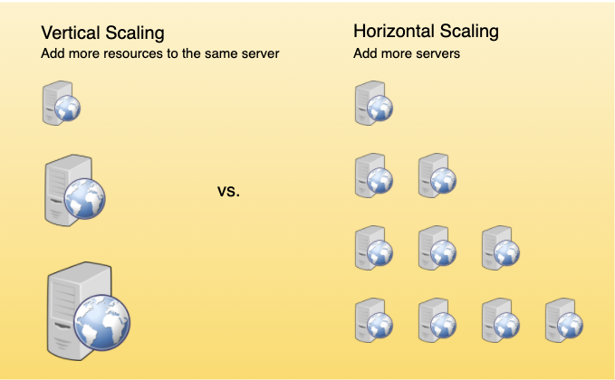

# KEY CHARACTERISTICS OF DISTRIBUTED SYSTEMS

1. [Scalability](#scalability)
2. [Reliability](#reliability)
3. [Availability](#availability)
4. [Efficiency](#efficiency)
5. [Serviceability or Manageability](#serviceability-or-manageability)

## SCALABILITY

This is the ability of the system, process, or a network to grow and manage increased demand. A distributed system that can continuously evolve in order to support the growing amount of work is considered scalable.

There should be no massive performance loss.

Generally, the performance iof a system declines with the system size because of management/environment cost. Network speeds are slower when machines are far apart from each toher. Additionally, some tasks may not be distrubted, either because of their inherent atomic nature or because of some flaw in the system design.

These tasks would limit the speed that can be obtained by the distributed system. Architecutre that can scale avoids this situation and attempts to balance the load on all participating nodes in the system evenly.

#### HORIZONTAL SCALING

Horizontal scaling means that you can by adding more machines (servers) into your pool of resouces. You have more nodes in the system.

This is often easier to do dynamically (especially with the advent of cloud computing) since you can just spool up a new machine when demand spikes.

Examples of this include Cassandra or MongoDB as they scale horizontally by adding more machines to meet growing demand.

#### VERTICAL SCALING

Vertical scaling means that you add more power (e.g. CPU, RAM, etc.) onto a server.

This is more difficult as you often have downtime and comes with an upper limit before more downtime.

A good example of vertical scaling is MySQL as it allows for switching from smaller to bigger machines that involves downtime.

## RELIABILITY

## AVAILABILITY

## EFFICIENCY

## SERVICEABILITY OR MANAGEABILITY
