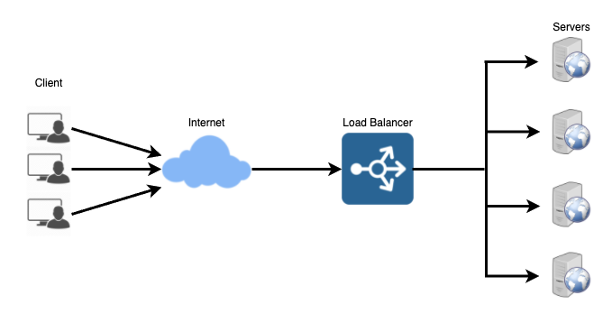
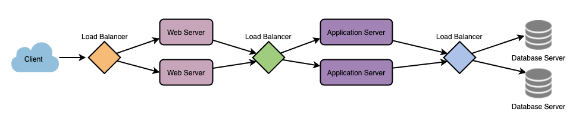
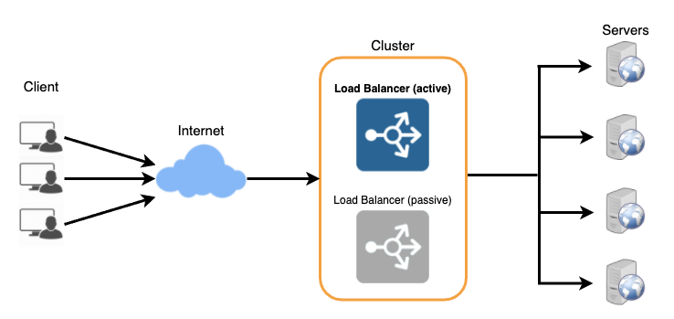

# LOAD BALANCING

1. [Summary](#summary)
2. [Benefits of Load Balancing](#benefits-of-load-balancers)
3. [Load Balancing Algorithms](#load-balancing-algorithms)
   - [Health Check](#health-check)
   - [Load Balancing Methods](#load-balancing-methods)
4. [Redundant Load Balancers](#redundant-load-balancers)

## SUMMARY

Load Balancers (LBs) are a critical component of distributed systems which spread traffic across a cluster of servers to improve responsiveness and availability of applications, websites, or databases. LBs also keep track of the status of all the resources while distributing requests.

LBs will stop sending traffic to a node if its not avaialble to take a request, is not responding, has an elevated error rate, etc.

Load Balancers sit between the client and server (typically) and accepts incoming network and application traffice. It will then distribute the traffic across multiple back-end servers using various algorithms. This reduces individual server load and prevents any one application server from becoming a single point of failure, thus improving overall application availability and responsiveness.

We can use LBs in three spots:

1. Between the user and the web server
2. Between web servers and an internal platform layer (applications or cache servers)
3. Between internal platform layers and databases

## BENEFITS OF LOAD BALANCERS

The benefits of using a LB include faster, uninterrupted service. Users won't wait for a single server to finish its previous tasks. The user gets their requests back immediately from a ready resource.

Also, there's less downtime and higher throughput. A full server failure won't affect the end user experience as the load balancer will simply route new traffic to a healthy server.

LBs make it easier for system admins to handle incoming requests. Smart LBs have things like predictive analytics that determine traffice bottlenecks before they happen. These give an organization actional insights and can drive business decisions.

System admins experience fewer failed or stressed components when using LBs. Tons of devices get the workload distributed.

## LOAD BALANCING ALGORITHMS

There are two factors to consider when choosing a back-end server:

1. Ensuring that the server they choose is actually responding to requests
2. Using a pre-config algorithm to choose a server from the pool of healthy ones

### HEALTH CHECK

LBs should only forward traffic to healthy back-end servers. Health checks will regularly attempt to connect to back-end servers to ensure that servers are listening. If a server fails a health check, it is automatically removed from the pool. Traffic will not be forwarded to it again until it passes the health check.

### LOAD BALANCING METHODS

Some of the load balancing algorithms include:

1. **Least Connection Method** - Directs traffic to the server with the fewest active connections. This is useful when there are a large number of _persistent_ client connections which are unevenly distributed between the servers.
2. **Least Response Time Method** - This directs traffic to the server with the fewest active connections and the lowest average response time.
3. **Least Bandwidth Method** - This selects the server that is currently serving the least amount of traffic measure in megabits per second (Mbps).
4. **Round Robin Method** - This method cycles through a list of servers and sends each new request to the next server. When it reaches the end of the list, it starts over at the start. It is useful when the servers are equal and there are not many persistent connections.
5. **Weighted Round Robin Method** - This is designed to handle servers with different processing capacities. Each server has a weight (an integer). Servers with higher weights receive new connections and more connections before those with less weights.
6. **IP Hash** - Under this method, a hash of the IP address of the client is calculated to redirect the request to a server.

## REDUNDANT LOAD BALANCERS

An LB can be a single point of failure, so a second load balancer can be connected to the first to form a cluster. Each LB monitors the health of the other and one will take over for the other if one of them fails.

