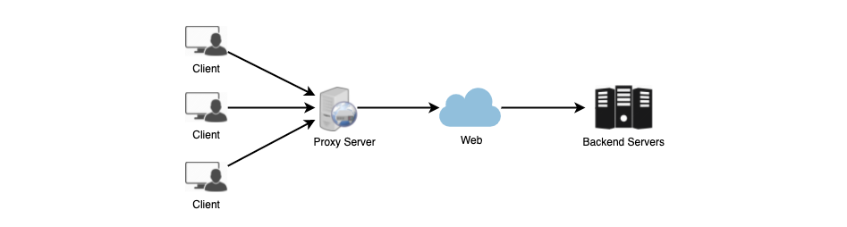

# PROXIES 🧙

1. [Summary](#summary)
2. [Proxy Server Types](#proxy-server-types)
   - [Open Proxy](#open-proxy)
   - [Reverse Proxy](#reverse-proxy)

## SUMMARY

A proxy server is an intermediate server between the client and the back-end. Clients connect to the proxy server to make a request for a service like a web page, file, or connection. Proxies are software or hardware that act as intermediaries for requests from clients.

Proxies are typically used to filter requests, log requests, or sometimes transform requests (by adding/removing headers, encrypting/decrypting, or compressing a resource). Another advantage of a proxy server is that its cache can server a lot of requests. If multiple clients access the same resource, a proxy can cache it and server it to all the clients without going back and forth repeatedly to the remote server.

## PROXY SERVER TYPES

Proxies can sit anywhere from client-side to the remote back-end servers. Here's two good examples:

### OPEN PROXY

An [open proxy](https://en.wikipedia.org/wiki/Open_proxy) is where the proxy is accessible by any Internet user. A proxy server only allows users within a network group (i.e. a closed proxy) to store and forward Internet services such as DNS or web pages to reduce and control the bandwidth used by the group. With an open proxy, however, any user on the Internet is able to use this forwarding service. There are two famous types:

1. **The Anonymous Proxy** - This reveals its identity as a server but does not disclose the initial IP address. The discovery of this proxy server can be beneficial for some users as it also hides their IP address.

2. **Transparent Proxy** - This identifies itself and, with the support of HTTP headers, the first IP address can also be viewed. The benefit of this sort of server is its ability to cache websites.

### REVERSE PROXY

A [reverse proxy](https://en.wikipedia.org/wiki/Reverse_proxy) retrieves resources on behalf of a client from one or more servers. These resources are then returned to the client, appearing as if they originated from the proxy server itself. This one is super common too.
