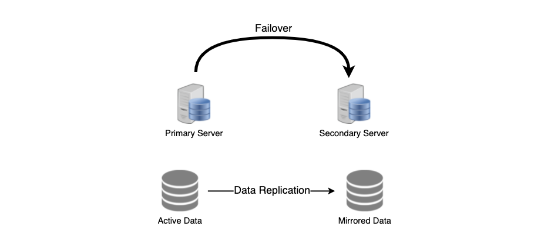

# REDUNDANCY AND REPLICATION 👯

1. [Redundancy](#redundancy)
2. [Replication](#replication)

## REDUNDANCY

Redundancy is the duplication of critical components or functions of a system with the intention of increasing the reliability of the system, usually in the form of a backup or fail-safe, or to improve the actual performance of the system.

Redundancy plays a key role in removing the single points of failure in the system and provides backups if needed in a crisis. For example, having two instances of a service running in production allows failover to the other one:

## REPLICATION

Replication, on the other hand, is the sharing of information to ensure consistency between redundant resources like software or hardware components to improve reliaiblity, get fault-tolerance, and improve accessibility.

Replication is used in many database management systems (DBMS), usually with a primary-replica relationship between the original and the copies. The primary server gets all the updates which then ripple through to the replicas. Each replica outputs a message saying that it has received the message successfully, thus allowing it to receive more subsequent updates.

