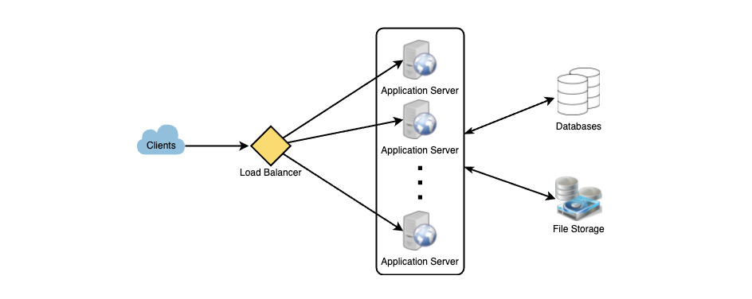

[<-- HOME](../README.md)

# STEP-BY-STEP GUIDE 🗺

Many software engineers struggle with system design interviews (SDIs). This is due to the vague nature inherent to them; they are unstructured, most people don't have experience designing large scale distrubuted systems, and people just flat-out don't spend enought time preparing for them.

## TABLE OF CONTENTS

1. [Step 1: Requirements](#step-1-requirements)
2. [Step 2: Make Some Estimates](#step-2-make-some-estimates)
3. [Step 3: Define the System Interface](#step-3-define-the-system-interface)
4. [Step 4: Define the Data Model](#step-4-define-the-data-model)
5. [Step 5: Make the Meta-Level Design](#step-5-make-the-meta-level-design)
6. [Step 6: Detailed Design](#step-6-detailed-design)
7. [Step 7: Figure Out (and Resolve) Bottlenecks](#step-7-figure-out-and-resolve-bottlenecks)

## STEP 1: REQUIREMENTS

You should always ask questions about the scope of the problem that you're trying to solve. These types of problems are open-ended, and they don't really have a single correct answer.

Get clarifications on ambiguities whenever you can. Getting a clear picture always sets you up for success. Since you will only have 30-45 minutes to design a system, you will need to get clarification on which parts of the system you'll _actually_ be focusing on.

For instance, here's an example of designing a social media system:

1. Will users make posts and follow other people?
2. Should we design to create/display a home timeline?
3. Are we dealing with media (photos, videos, audio)?
4. Is this back-end only, or should we design the front-end as well?
5. Will users be able to search on this platform?
6. Do we have trending topics?
7. Should users receive push notifications?

These aren't a complete list, but this illustrates how we could ask questions that clarify requirements for the interview.

## STEP 2: MAKE SOME ESTIMATES

We should estimate the scale that we're designing. This helps us later when we focus on scaling, partitioning, load balancing, and caching.

1. What scale is expected from the system (number of posts, number of view on the home timeline per second, number of users per day, etc.)?
2. How much storage should we set up? The needs will also be drastically different if the users store various types of media depending on what that media is.
3. What kind of network bandwidth usage should we expect on the system? We'll need to manage traffic and balance load between any of our servers that we design.

## STEP 3: DEFINE THE SYSTEM INTERFACE

Define the APIs needed in the system. Some of these could include:

```python
submit_post(user_id, post_data, user_location, timestamp, ... )

generate_timeline(user_id, current_time, user_location, ... )

mark_post_favorite(user_id, post_id, timestamp, ... )
```

## STEP 4: DEFINE THE DATA MODEL

Figuring out the data model for the system early on will clarify in the interview how you'll be handling the data flow between different components of the system. It will also inform your choices for data partitioning and management. You should be able to identify various entities of the system, how they will interact with each other, and different aspects of data management like the storage, transportation, encryption of data, etc.

Here are some examples of entities that could be created (with their associated table fields) for a system like the one sketched out above:

```
USER: UserID, Name, Email, DateOfBirth, CreationDate, LastLogin, etc.

POST: PostID, Content, PostLocation, NumberOfLikes, TimeStamp, etc.

USER_FOLLOW: UserID1, UserID2, etc.

FAVORITE_POSTS: UserID, PostID, Timestamp
```

Also, what database and type (NoSQL or SQL) should we use? Will NoSQL like a MongoDB best fit our needs, or should we use a MySQL-like solution? How will we do block sroage for media like photos and videos.

## STEP 5: MAKE THE META-LEVEL DESIGN

We want to diagram out the high-level of our system with a few blocks that demonstrate the core building blocks of our system. This should solve the problem from end-to-end without getting into the weeds.

For instance, the company we've been talking about in previous sections will need multiple application servers to serve all the read/write requests with load balancers in front of them for even traffic distribution.

If we need a lot more read traffic than writing, we'll want to have different servers handle those cases. We want a back-end that has an efficient database that can store all the posts and support a _massive_ number of reads. We will also need a distrubted file storage system for any media that users want to save.



## STEP 6: DETAILED DESIGN

You will probably have time to dig into one or three major areas of the system design. This will revolve around the interviewer's preference. You should present different options to the interviewer, each with their pros and cons. Remember, there isn't a single correct answer - Like life, system design has many correct options that could work. It's up to you to point out the pros and cons and then work with the interviewer to move forward on one. Consider the tradeoffs carefully.

- If we're storing massive amounts of data, how should we partition our data to distribute it to multiple databases? Should we store all of the data for a single user in the same database? What problems could we have here?
- How will we handle hot users who user our service a lot in a content creator role?
- If the home timeline for users will have recent/relevant posts, should we store our data so that it is optimized for scanning the latest posts?
- How much and at which layer should we introduce caches to speed things up?
- What components need better load balancing?

## STEP 7: FIGURE OUT (AND RESOLVE) BOTTLENECKS

Systems invariably hit bottlenecks because there are always tradeoffs. How can we mitigate these?

If there is a single point of failture in our system, what are we doing to solve this?

Are there enough replications of data so that we can still serve or users if we lose a few servers?

Do we have enough copies of different services running such that a few failures will not cause a total shutdown?

How are we monitoring performance? Do we get alerts whenever there's critical issues that fail or degrade?

[Back to Top](#step-by-step-guide)
