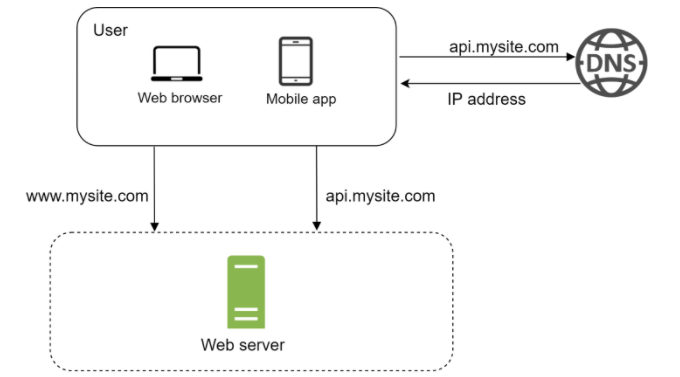
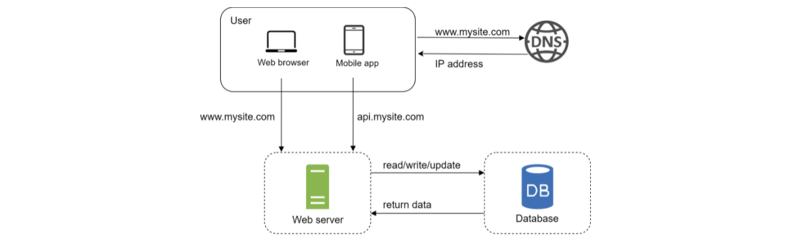
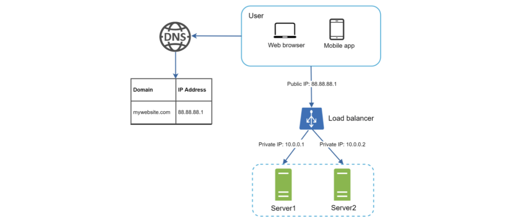
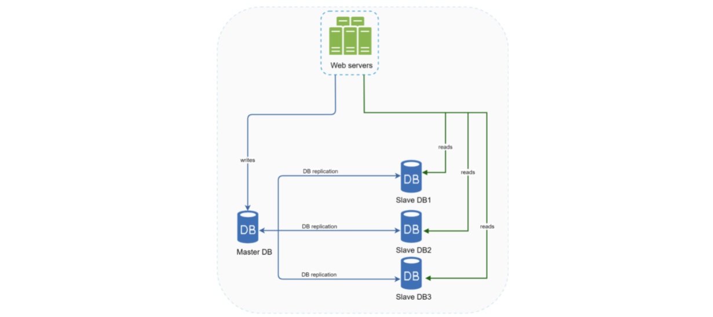
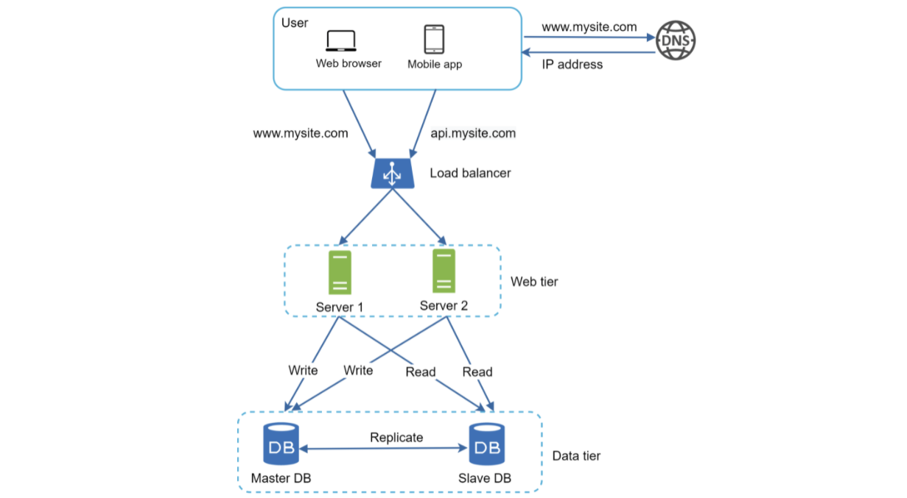

# SCALE FROM ZERO TO MILLIONS

This is a beginning problem that will give a sense of the general process of setting up a server and scaling it up to millions of users.

Difficulty: _Easy_

## TABLE OF CONTENTS

1. [Single Server Setup](#single-server-setup)
2. [Initial Growth](#initial-growth)
3. [Vertical vs Horizontal Scaling](#vertical-scaling-versus-horizontal-scaling)
4. [Load Balancer](#load-balancer)
5. [Database Replication](#database-replication)
6. [Cache](#cache)

## SINGLE SERVER SETUP

A single server setup refers to having your clients and a single server that serves data and corresponding business logic up to them. It's the simplest setup possible that we can have.

Here's an example:



In this setup, users access websites through domain names. The Domain Name Service (DNS) is provided by 3rd parties and not hosted by our servers.

The IP address is returned by the DNS service to the mobile client or web app.

Once this IP address is obtained, the HTTP requests are sent directly to the web server.

The web server returns either data or HTML pages.

The traffic comes to your web server from either the web app or the mobile app.

A response might look something like:

_GET /users/12 – Retrieve user object for id = 12_

```json
{
    "id": 12,
    "firstName": "Nathan",
    "lastName": "Thomas",
    "address": {
        ...
    },
    "phoneNumbers": {
        ...
    }
}
```

## Initial Growth

If our app experiences a bit of growth, one server will no longer be enough. We need multiple servers... One for web/mobile traffic, and another for the database. Separating web/mobile traffic (web tier) and database (data tier) servers allows them to be scaled independently.



Choosing your database is important. The meta-level is relational or non-relational.

Relational database management systems (RDBMS), also called SQL databases, are extremely popular. The most popular ones are MySQL, Oracle database, PostgreSQL, etc. They store data in tables and rows. You can perform join operations using SQL across different database tables.

Non-relational databases are also called NoSQL. Popular ones are CouchDB, Cassandra, Amazon DynamoDB, MongoDB, etc. Databases are grouped into four categories - key-value stores, graph stores, column stores, and document stores. Join operations are generally not supported in non-relational databases.

Most developers choose relational databases since they've been around for over 40 years and have worked well.

Non-relational databases might be the best choice if:

- Your app needs low-latency
- Your data is unstructured or you don't have relational data
- You only need to serialize and deserialize data (JSON, XML, YAML, etc.)
- You need to store a massive amount of data

## VERTICAL SCALING VERSUS HORIZONTAL SCALING

Vertical scaling, called scaling up, means the process of adding more CPU, RAM, etc. to your servers.

Horizontal scaling, called scaling out, means adding more servers to your pool of resources.

Low traffic means vertical scaling is a great option since it's easy. But it has drawbacks, namely that it has a hard limit of CPU/memory on a single server and it does not have failover or redundancy. If one server goes down (in our current example), the entire app goes down with it.

Horizontal scaling is more desirable for large scale applications due to the limitations of vertical scaling.

If we're going to horizontally scale, we need a load balancer.

## Load Balancer

A load balancer distributes incoming traffic among web servers that are defined in a load-balanced set.

Example:


In this setup, web servers are unreachable behind the load balancer for the client applications. A private IP should be used by the servers. This IP address is reachable only between servers on the same network. The load balancer will communicate with web servers through private IPs.

When a load balancer is added with additional servers, we can successfully solve the no failover issue and have improved the availability of the web tier servers.

If server 1 goes down, all traffic can be routed to server 2. Then we can add another 3rd server to balance the load. If the website traffic grows rapidly, two servers won't be enough. We can merely add more servers to the web server pool and the load balancer automatically starts sending requests across all of the available servers.

Now the web tier looks great. What about the data tier?

## Database Replication

Database replication can be used in many database management systems, usually with a main/follower relationship between the original (main) and the copies (followers).

A main database generally only supports write operations. The follower databases get copies of the data from the main database and only support read operations. All the data moidfying commands like insert, delete, or update must be sent to the main database. Most applications require a much higher ratio of read to writes. Thus, the number of follower databases is usually larger than the number of main databases.

Example:



The advantage of database replication is that:

- **Better Performance:** In the main-follower model, all writes and updates happen on main nodes. Whereas, read operations are distributed across all follower nodes. This model improves performance because it allows more queries to be processed in parallel.
- **Reliability:** If one of the databases gets detroyed, data is still preserved. You don't need to worry about data loss because data is replicated across locations.
- **High availability:** By replicating data across locations, your website remains in operation even if a database goes offline since you can get to data in another server.

Here's how we could handle load balancing the data tier:

- If only one follower database is available and goes offline, read operations will be directed to the main database temporariliy. When the issue is found, we can have a new follower replace the old one. If we have multiple followers, read operations can be redirected to the healthy ones and a new database can replace the bad database.
- If the main database goes offline, a follower can be seamlessly promoted to the new main and a new follower can be provisioned to replace it. In production systems, promoting a new main is more complicated as the data in the main might not be up to date. the missing data needs to be updated by running data recovery scripts. These scripts are beyond were we're at right now.

Example:



Here, a user gets the IP address of the load balancer for the site from the DNS. A user connects the load balancer with this IP address. The HTTP request is routed to either server 1 or 2. The web server reads from the follower database or routes a write request to the main database.

This completes a solid understanding of the meta-level web and data tiers. It's time to improve load and response times. This can be done by adding a cache layer and shifting static content to a Content Delivery Network (CDN).

## Cache

A cache is literally just a temporary storage area that stores the result of expensive responses or frequently-accessed data in memory so that subsequent requests are served more quickly.

Every time a new web page loads, one or more database calls are executed to fetch data. the application performance is affected by this due to the repeated database calls. A cache fixes this.

The cache tier is a temporary data store layer that is much faster than a database. This results in better system performance, ability to reduce databse workloads, and the ability to scale the cache tier independently.

After receiving a request, a web server will first check if the cache has the avilable response. If it does, it sends the data back to the client. If not, it queries the database, stores the response in the cache, and sends it back to the client. This strategy is known as read-through cache. other strategies are available depending on the data type, size, and access patterns.

Interacting with cache servers is simple because most provide APIs for common programming languages. The following snippet shows Memcached APIs:

```
SECONDS=1
cache.set("myKey", "hi there", 3600 * SECONDS)
cache.get("myKey")
```
