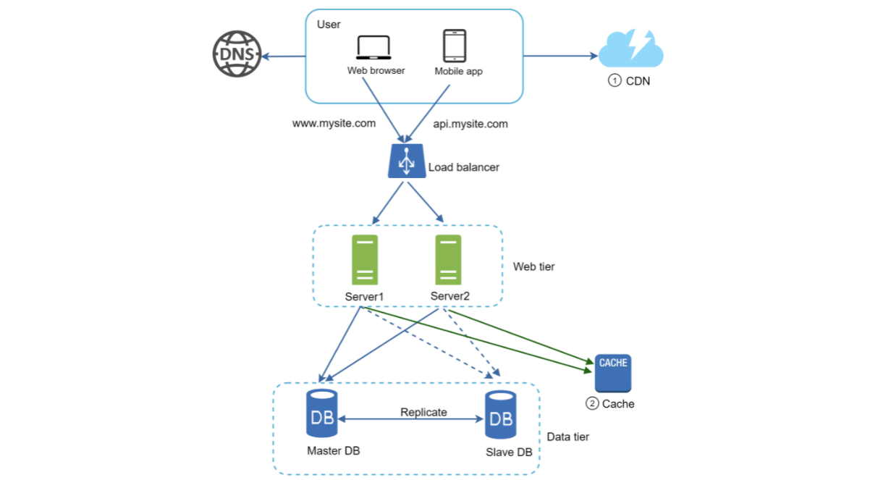
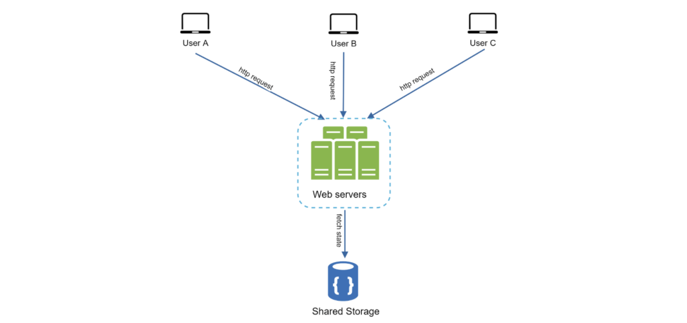
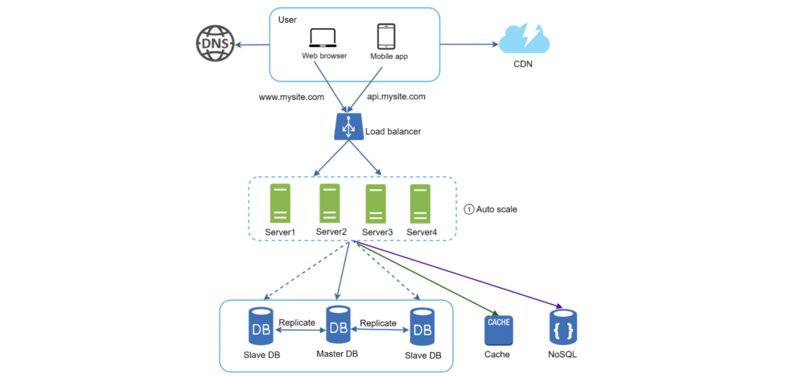
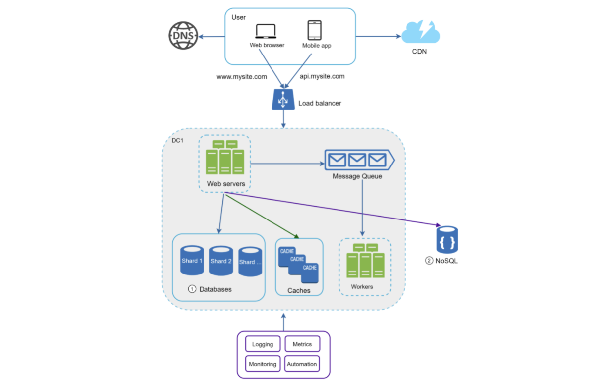

# SCALE FROM ZERO TO MILLIONS

This is a beginning problem that will give a sense of the general process of setting up a server and scaling it up to millions of users.

Difficulty: _Easy_

## TABLE OF CONTENTS

1. [Single Server Setup](#single-server-setup)
2. [Initial Growth](#initial-growth)
3. [Vertical vs Horizontal Scaling](#vertical-scaling-versus-horizontal-scaling)
4. [Load Balancer](#load-balancer)
5. [Database Replication](#database-replication)
6. [Cache](#cache)
7. [Content Delivery Network (CDN)](#content-delivery-network-cdn)
8. [Stateless Web Tier](#stateless-web-tier)
9. [Data Centers](#data-centers-dc)
10. [Messaging Queue](#messaging-queue)
11. [Logging, Metrics, and Automation](#logging-metrics-and-automation)
12. [Database Scaling](#database-scaling)

## SINGLE SERVER SETUP

A single server setup refers to having your clients and a single server that serves data and corresponding business logic up to them. It's the simplest setup possible that we can have.

Here's an example:


In this setup, users access websites through domain names. The Domain Name Service (DNS) is provided by 3rd parties and not hosted by our servers.

The IP address is returned by the DNS service to the mobile client or web app.

Once this IP address is obtained, the HTTP requests are sent directly to the web server.

The web server returns either data or HTML pages.

The traffic comes to your web server from either the web app or the mobile app.

A response might look something like:

_GET /users/12 – Retrieve user object for id = 12_

```json
{
    "id": 12,
    "firstName": "Nathan",
    "lastName": "Thomas",
    "address": {
        ...
    },
    "phoneNumbers": {
        ...
    }
}
```

## Initial Growth

If our app experiences a bit of growth, one server will no longer be enough. We need multiple servers... One for web/mobile traffic, and another for the database. Separating web/mobile traffic (web tier) and database (data tier) servers allows them to be scaled independently.


Choosing your database is important. The meta-level is relational or non-relational.

Relational database management systems (RDBMS), also called SQL databases, are extremely popular. The most popular ones are MySQL, Oracle database, PostgreSQL, etc. They store data in tables and rows. You can perform join operations using SQL across different database tables.

Non-relational databases are also called NoSQL. Popular ones are CouchDB, Cassandra, Amazon DynamoDB, MongoDB, etc. Databases are grouped into four categories - key-value stores, graph stores, column stores, and document stores. Join operations are generally not supported in non-relational databases.

Most developers choose relational databases since they've been around for over 40 years and have worked well.

Non-relational databases might be the best choice if:

- Your app needs low-latency
- Your data is unstructured or you don't have relational data
- You only need to serialize and deserialize data (JSON, XML, YAML, etc.)
- You need to store a massive amount of data

## VERTICAL SCALING VERSUS HORIZONTAL SCALING

Vertical scaling, called scaling up, means the process of adding more CPU, RAM, etc. to your servers.

Horizontal scaling, called scaling out, means adding more servers to your pool of resources.

Low traffic means vertical scaling is a great option since it's easy. But it has drawbacks, namely that it has a hard limit of CPU/memory on a single server and it does not have failover or redundancy. If one server goes down (in our current example), the entire app goes down with it.

Horizontal scaling is more desirable for large scale applications due to the limitations of vertical scaling.

If we're going to horizontally scale, we need a load balancer.

## Load Balancer

A load balancer distributes incoming traffic among web servers that are defined in a load-balanced set.

Example:


In this setup, web servers are unreachable behind the load balancer for the client applications. A private IP should be used by the servers. This IP address is reachable only between servers on the same network. The load balancer will communicate with web servers through private IPs.

When a load balancer is added with additional servers, we can successfully solve the no failover issue and have improved the availability of the web tier servers.

If server 1 goes down, all traffic can be routed to server 2. Then we can add another 3rd server to balance the load. If the website traffic grows rapidly, two servers won't be enough. We can merely add more servers to the web server pool and the load balancer automatically starts sending requests across all of the available servers.

Now the web tier looks great. What about the data tier?

## Database Replication

Database replication can be used in many database management systems, usually with a main/follower relationship between the original (main) and the copies (followers).

A main database generally only supports write operations. The follower databases get copies of the data from the main database and only support read operations. All the data moidfying commands like insert, delete, or update must be sent to the main database. Most applications require a much higher ratio of read to writes. Thus, the number of follower databases is usually larger than the number of main databases.

Example:


The advantage of database replication is that:

- **Better Performance:** In the main-follower model, all writes and updates happen on main nodes. Whereas, read operations are distributed across all follower nodes. This model improves performance because it allows more queries to be processed in parallel.
- **Reliability:** If one of the databases gets detroyed, data is still preserved. You don't need to worry about data loss because data is replicated across locations.
- **High availability:** By replicating data across locations, your website remains in operation even if a database goes offline since you can get to data in another server.

Here's how we could handle load balancing the data tier:

- If only one follower database is available and goes offline, read operations will be directed to the main database temporariliy. When the issue is found, we can have a new follower replace the old one. If we have multiple followers, read operations can be redirected to the healthy ones and a new database can replace the bad database.
- If the main database goes offline, a follower can be seamlessly promoted to the new main and a new follower can be provisioned to replace it. In production systems, promoting a new main is more complicated as the data in the main might not be up to date. the missing data needs to be updated by running data recovery scripts. These scripts are beyond were we're at right now.

Example:


Here, a user gets the IP address of the load balancer for the site from the DNS. A user connects the load balancer with this IP address. The HTTP request is routed to either server 1 or 2. The web server reads from the follower database or routes a write request to the main database.

This completes a solid understanding of the meta-level web and data tiers. It's time to improve load and response times. This can be done by adding a cache layer and shifting static content to a Content Delivery Network (CDN).

## Cache

A cache is literally just a temporary storage area that stores the result of expensive responses or frequently-accessed data in memory so that subsequent requests are served more quickly.

Every time a new web page loads, one or more database calls are executed to fetch data. the application performance is affected by this due to the repeated database calls. A cache fixes this.

The cache tier is a temporary data store layer that is much faster than a database. This results in better system performance, ability to reduce databse workloads, and the ability to scale the cache tier independently.

After receiving a request, a web server will first check if the cache has the avilable response. If it does, it sends the data back to the client. If not, it queries the database, stores the response in the cache, and sends it back to the client. This strategy is known as read-through cache. other strategies are available depending on the data type, size, and access patterns.

Interacting with cache servers is simple because most provide APIs for common programming languages. The following snippet shows Memcached APIs:

```
SECONDS=1
cache.set("myKey", "hi there", 3600 * SECONDS)
cache.get("myKey")
```

Considerations for a cache include:

- Decide when to use a cache. If data is read frequently but modified infrequently, they can be a great choice. A cache server is not ideal for persisting data. If the cache server restarts, all the data will be lost. Thus, important data should be saved to the database.
- It's good practice to have an expiration policy on cached data that will automatically remove it from the cache. When there's no expiration policy, cached data will be stored in the memory permanently until the cache is restarted. This is not advisable. You should make it medium length and not too short since a short policy will result in many requests to the database.
- Consistenty: You need to have the database and cache in sync. When scaling across multiple regions, maintaining consistency between the data store and cache is challenging.
- Mitigating failures: A single cache server represents a potential point of failure (SPOF) which means that, if it fails, it will stop the entire system from working. Multiple cache servers across different data centers are recommended to avoid SPOF. You could also overprovision the rquired memory by certain percentages. This provides a buffer.


- Eviction policy: Once the cahe is full, any new requests to add items might require items to be removed. Least Recently Used (LRU) is the most popular cache evication policy. Other ones like Least Frequently Used (LFU) or First In, First Out (FIFO) can be adopted to satisfy different use cases.

## CONTENT DELIVERY NETWORK (CDN)

A CDN is a network of geographically dispersed servers that can deliver static content. CDN servers cache static content like images, videos, CSS, JavaScript files, etc.

Dynamic content caching is a relatively new concept and byond the scope of where we're at.
But it can enable the caching of HTML pages that are based on request path, query strings, cookies, request headers, etc. We'll talk here about CDN caching for static content.

When a user visits a website, a CDN server closest to the user will deliver static content. The further users are from CDN servers, the slower the page loads.

Example:


Considerations of a CDN include:

- **Cost:** CDNS are run by 3rd party providers, and you are charged for data transfers in and out of CDN. Caching infrequently used assets provides no benefits and you have to pay for it.
- **Cache Expiry:** For time-sensitive content, setting a cache expiry time is important. The expiry time should neither be too long nor too short. If it is too long, the content might no longer be fresh. If it is too short, it can cause repeat reloading of content from origin servers to the CDN.
- **CDN fallback:** You should consider how your website/application copes with CDN failure. If there is a temporary CDN outage, clients should be able to detect the problema nd request resources from the origin.
- **Invalidating files:** You can remove a file from the CDN before it expires by invalidating via API from the CDN vendor or serving a different version of the data object.

Here's our application design with the CDN added:



This serves static assets via CDN instead of web servers and the database is lightened by caching data.

## Stateless Web Tier

Now, we finally get to consider scaling the web tier horizontally.

We need to move state (like user session data) out of the web tier. A good practice is to put session data into persistent storage like a RDBMS or NoSQL. Then each web server can access that session data.

A stateful server and stateless server have some key differences. A stateful server remembers client data from one request to the next. A stateless server keeps no state information.

If servers are stateful, every request from the same client must be routed to the same server. This can be done with sticky sessions in most load balancers, but this adds overhead. Also, adding/removing servers is hard in this approach.

Instead, we should have a stateless architecture:



This way, HTTP requests from users can be routed to any web server and fetch state data from a shared data store. State data is stored in a shared data store and kept out of web servers. This system is simpler, more robust, and highly scalable.

Here's our system with a stateless web tier:



We've now moved the session data out into a NoSQL server/database that can persist the data seperately from the web tier servers.

NoSQL was chosen as it's easy to scale.

Also, making the web tier servers stateless measn that it's now easy to add or remove servers based on traffic load.

Now we need to solve the problem of our growing traffic that's geographically distributed.

## Data Centers (DC)

In a normal operation, users are geoDNS routed, or geo-routed, to the closest data center. Lots of the time, companies will have US-East and US-West with US-West receiving a (100-x)% of the traffic.

This geoDNS is a service that allows domain names to be resolved to an IP address depending on the geographic location of a user.


If there's a significant DC outage, you can failover all traffic to a healthy data center.

There are several challenges to the multi-data-center setup:

- **Traffic redirection:** Tools must be in place to direct traffic to the correct data center. GeoDNS can be used to direct traffic to the nearest data center depending on where a user is located.
- **Data synchronization:** Users from different regions could use different databases or caches. In failover cases, traffic might be routed to a data center where data is unavailable. A common strategy is to replicate data across multiple data centers.
- **Test and deploy:** With a multi-DC setup, we should test our website/application at different locations. Automated deployment tools are vital to keep services consistent across all the data centers.

Now we need to decouple different components of the system so they can be scaled independently. Having a messaging queue is a key strategy employed by many real-world distributed systems to solve this problem.

## MESSAGING QUEUE

A messaging queue is a component, stored in memory, that supports async communication. It serves as a buffer and distributes async requests. The basic architecture of a message queue is simple.

Input services, called producers or publishers, create messages that are added to the queue (called publishing). Other services or servers, called consumers or subscribers, connect to the queue ad perform actions defined by the messages.

Example:


A producer can post a message to the queue when the consumer is unavailable to process it. The consumer can read messages from the queue when the producer is unavailable.

For instance, an app that supports photo processing like cropping, blurring, etc. could publish jobs to the message queue and then subscribers could pick up jobs when they're available and do the tasks. The producer and consumer side can each be scaled independently. When the size of the queue becomes large, more works are added to reduce the processing time.

## Logging, Metrics, and Automation

When working with a small website that runs on a few servers, logging/metrics/automation are good but not a necessity. But a bigger application means that these tools are essential.

Logging is usually monitoring error logs to identify errors in the system.

Metrics help you gain business insights and understand the health status of the system. Some of these include host level metrics like CPU, memory, disk I/O, etc., aggregated level metrics like the performance of the entire database tier, cache tier, etc., and bueinss metrics like daily active users, retention, revenue, etc.

Automation is when we start leveraging tools to improve productivity. Continuous Integration (CI) is a good practice in which code check-ins are verified through automation. This allows teams to detect problems early and also improves developer productivity.

## DATABASE SCALING

The two broad approaches for database scaling are vertical and horizontal scaling.

**Vertical Scaling**

Just like we previously discussed, this is scaling by adding more CPU, RAM, DISK, etc. to the machine. Amazon RDS offers 24tb of RAM.

Vertical scaling comes with drawbacks:

1. You can add more resources to your server, but there are hardware limits. For a large user base, a single server is not enough.
2. Greater single point of failure (SPOF)
3. Overall cost is higher for vertical scaling

**Horizontal Scaling**

This practice is also known as sharding. You add more servers.

Sharding separates large databases into smaller, more easily-managed parts called shards. Each shard shares the same schema, but the data is unique.

Whenever data is accessed, a hash function is used to find the corresponding shard. For instance, `user_id % 4` is a good way to find data in this example:


If the result is 0, shard 0 is used to store/fetch data.

When using this stategy, the most important factor is the sharding key. This key (also known as the "partition key") consists of one or more columns that determine how data is distributed. It allows you to retrieve and modify data efficiently by routing database queries to the correct database. When choosing a sharding key, one of the most important criteria is to choose a key that can be evenly distributed.

Sharding has complexities and new challenges:

- **Resharding data:** This happens when a single shard can no longer hold more data. This can happen when certain shards experience shard exhaustion due to uneven data distribution. Consistent hashing solves this.
- **Celebrity problem:** Excessive access to a specific shard could cause server overload. For instance, info about Justin Biever, Lady Gaga, etc. might overwhelm a single shard. To solve this, we might need to allocate a shard for each celebrity. This would require further partition.
- **Join and de-normalization:** When we shard across multiple servers, it's hard to perform join operations across the shards. A workaround is to de-normalize the database so queries can be performed in a single table.

Example of sharding:


